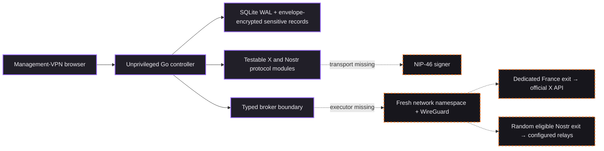

<div align="center">

# NomadPosting

**Building a cross-poster that fails closed.**

[](https://github.com/s00ly/nomadposting/actions/workflows/ci.yml)

Proof-oriented cross-posting research for Nostr and X, written in Go.

[Threat model](docs/THREAT_MODEL.md) · [Security policy](docs/SECURITY.md) · [Verification record](docs/VERIFICATION.md) · [Deployment boundary](deploy/DEPLOYMENT.md) · [Contributing](CONTRIBUTING.md) · [Governance](GOVERNANCE.md)

</div>

> [!CAUTION]
> **Research preview: dry-run only.** NomadPosting cannot publish posts or protect live credentials today. The controller rejects `IVPN_DRY_RUN=false`, and the privileged network executor is deliberately disabled until Linux packet captures prove zero direct fallback. Do not use real credentials.

NomadPosting is a security-first control plane for approving one exact text payload for Nostr, X, or both. The design aims to route each platform through policy-bound VPN egress without turning failure, ambiguity, or exit-country metadata into false privacy claims.

We are hardening the design in public so privacy engineers, Linux networking specialists, Nostr implementers, Go reviewers, accessibility experts, and adversarial testers can turn explicit release gates into reproducible proof.

## Why this exists

Cross-posting is easy. Proving that a publisher did not escape a failed VPN, duplicate an ambiguous request, leak credentials into logs, or imply a false physical location is harder.

NomadPosting turns those failure modes into explicit state transitions, testable security properties, and release gates. Freedom technology should make fewer promises and provide better evidence.

## Privacy boundary

A VPN changes network origin, not identity. X credentials, a Nostr public key, content, timing, VPN-provider metadata, and public activity remain correlatable. An exit country is routing metadata, never proof of the operator's physical location.

| The design aims to | It does not promise |
|---|---|
| Bind human approval to the exact payload and destinations | Anonymity, unlinkability, or untraceability |
| Fail closed when an isolated tunnel or route is unhealthy | Protection from a compromised host, signer, gateway, or VPN provider |
| Keep future Nostr country choices private | A physical-location claim or false geotag |
| Preserve `UNKNOWN` after ambiguous delivery instead of blindly resending | Atomic publication or rollback across X and Nostr |
| Keep X on one stable, dedicated exit | Platform-enforcement, rate-limit, or geographic-control evasion |

There is no browser posting, cookie reuse, CAPTCHA handling, residential proxy support, account fleet, or error-triggered IP switching.

## Current status

| Area | State |
|---|---|
| Approval, scheduling, encrypted content, audit, cancellation, and emergency stop | Implemented and tested |
| X and Nostr protocol/state modules | Implemented for dry-run verification; not wired to live transports |
| Nostr country-selection policy and typed broker boundary | Implemented and tested |
| Linux network namespaces, WireGuard, nftables, and validating DNS | Not implemented |
| Broker-backed dispatcher and live publication | Intentionally disabled |
| Production readiness | **No** |

The exact evidence, limitations, and unresolved gates are recorded in the [verification record](docs/VERIFICATION.md).

## Help harden NomadPosting

This project needs reviewers more than cheerleaders.

| Priority | Work that needs proof |
|---|---|
| P0 | Per-attempt Linux network namespaces, WireGuard, nftables, validating DNS, teardown, and physical-interface packet captures under tunnel loss |
| P0 | Broker-backed dispatcher with platform-pinned HTTP and WebSocket transports |
| P0 | Concrete NIP-46 transport, signer binding, permission enforcement, and BIP-340/Schnorr verification |
| P1 | Crash recovery and same-exit X reconciliation without blind duplicates |
| P1 | TPM or operating-system key sealing and encryption of currently plaintext operational indexes |
| P1 | NIP-11/NIP-65 relay review, X weighted-length conformance, and provisioned gateway health checks |
| P2 | Complete keyboard, screen-reader, 200% zoom, reduced-motion, and visual-regression testing |

Good starting points:

- challenge a trust boundary or untested assumption in the [threat model](docs/THREAT_MODEL.md);
- reproduce one of the [code-level adversarial rounds](docs/VERIFICATION.md#code-level-adversarial-rounds);
- turn a release blocker into a failing-before, passing-after test;
- review the egress selector, state machine, secret handling, or accessible UI without using live credentials.

Every privacy claim needs a named threat, a trust boundary, and a reproducible test. Medium-or-higher findings reopen the affected adversarial rounds. No `xfail`, `--no-verify`, swallowed errors, hardcoded bypasses, or unpinned dependencies.

## Target architecture

Purple nodes exist in the dry-run codebase. Orange dashed nodes are blocked release work.



The diagram is a target, not a deployment claim. X is intentionally pinned to one stable France exit. Only Nostr is designed for country rotation, and production rotation still depends on the missing isolation proof.

<details>
<summary><strong>What you can audit today</strong></summary>

- Go 1.26.5 server-rendered control plane with SQLite WAL.
- Two-passkey WebAuthn policy, CSRF-bound sessions, offline recovery-code rotation, and rate limiting.
- AES-256-GCM envelope encryption for content, credentials, OAuth tokens, receipts, auth records, and audit details. Job state, timestamps, destination flags, and payload hashes remain plaintext indexes.
- Exact normalized-payload preview and SHA-256 approval binding across content, destinations, and schedule.
- Explicit `DRAFT → APPROVED → ROUTING → PUBLISHING → COMPLETE | PARTIAL | FAILED | UNKNOWN` transitions.
- Testable official X API and OAuth 2.0 PKCE modules with fixed endpoints, bounded responses, no `geo`, one refresh after a definitive 401, and no automatic resend after an ambiguous transmission.
- NIP-01 event construction, NIP-46 kind restrictions, NIP-42 challenge binding, exact signed-event reuse, three configured relay identities, and modeled two-ack quorum. Production relay review and onboarding are not implemented.
- CSPRNG Nostr country selection, no adjacent-country repeat, three-healthy-country minimum, independent endpoint selection, and stable X egress policy.
- Registry-only broker requests: arbitrary commands, paths, routes, addresses, and shell fragments are not representable.
- Orange, purple, and graphite-gray cypherpunk UI with visible focus, reduced motion, label-plus-color states, and no pre-dispatch country disclosure.

</details>

## Five-minute dry run

Requirements: [Go 1.26.5](https://go.dev/doc/install) and a local browser. This mode is for UI and state-flow review only.

### Linux or macOS

```sh
git clone https://github.com/s00ly/nomadposting.git
cd nomadposting

export IVPN_MASTER_KEY="$(go run ./cmd/ivpn --generate-master-key)"
export IVPN_DEV_MODE=true
export IVPN_ORIGIN=http://localhost:8443
export IVPN_RPID=localhost
export IVPN_DRY_RUN=true

go run ./cmd/ivpn
```

### PowerShell

```powershell
git clone https://github.com/s00ly/nomadposting.git
Set-Location nomadposting

$env:IVPN_MASTER_KEY = (& go run ./cmd/ivpn --generate-master-key)
$env:IVPN_DEV_MODE = 'true'
$env:IVPN_ORIGIN = 'http://localhost:8443'
$env:IVPN_RPID = 'localhost'
$env:IVPN_DRY_RUN = 'true'

go run ./cmd/ivpn
```

Open <http://127.0.0.1:8443>. Development mode bypasses passkey enforcement and must never be used with live credentials. Runtime data is written under the ignored `data/` directory.

The `IVPN_*` prefix is a legacy internal name in the prototype configuration and is expected to change before a release.

## Verify the code

```sh
go mod verify
go test -count=1 ./...
go vet ./...
go run golang.org/x/vuln/cmd/govulncheck@v1.6.0 ./...
```

GitHub Actions additionally runs the race detector on Ubuntu and generates a module inventory for SBOM input. Actions and scanner versions are pinned in [`.github/workflows/ci.yml`](.github/workflows/ci.yml).

## Report a vulnerability

Do not put exploitable details, credentials, VPN configuration, account identifiers, or canary values in a public issue. Use [GitHub Private Vulnerability Reporting](https://github.com/s00ly/nomadposting/security/advisories/new). Public issues are appropriate for non-exploitable design questions, threat-model challenges, and hardening proposals.

No production release exists. Reports against `main` are accepted. Read the [security policy](docs/SECURITY.md) before testing.

## Project principles

- **Fail closed.** Missing proof disables live behavior.
- **Approval is exact.** Any payload or destination change invalidates consent.
- **Ambiguity is a state.** A timeout after transmission is not permission to resend.
- **Location is not identity.** Exit-country metadata never becomes a physical-presence claim.
- **Official protocols only.** No browser automation, session-cookie reuse, or platform-control workarounds.
- **Evidence over adjectives.** Builds are useful; packet captures, fault injection, and reproducible negative tests are release evidence.

## Documentation map

- [Threat model](docs/THREAT_MODEL.md): assets, actors, trust boundaries, abuse cases, and adversarial rounds
- [Security policy](docs/SECURITY.md): normative controls, secret handling, logging, retention, and release gates
- [Verification record](docs/VERIFICATION.md): passed checks, known findings, and explicit NO-GO decisions
- [Dependency license review](docs/DEPENDENCY_LICENSES.md): transitive license evidence and scanner decision record
- [Deployment boundary](deploy/DEPLOYMENT.md): disabled broker and Linux release gate
- [Architecture decisions](docs/adr): product boundary, location ethics, and retention
- [Infrastructure topology](infra/README.md): credential-free OpenTofu manifest, not provisioned infrastructure
- [Governance](GOVERNANCE.md): decision, maintainer, security-authority, and succession rules
- [Maintainers](MAINTAINERS.md): current ownership and bus-factor status
- [Code of Conduct](CODE_OF_CONDUCT.md): community standards and private enforcement contact
- [Name and provenance](BRAND_POLICY.md): accurate fork and official-build representation

## License and contributions

NomadPosting is licensed under the [GNU Affero General Public License,
version 3 or later](LICENSE), identified by SPDX as `AGPL-3.0-or-later`.
Modified versions used to provide network interaction must offer their
corresponding source to those users as required by the license.

Contributions use the same license and the [Developer Certificate of Origin
1.1](DCO). Every commit requires an author-matching `Signed-off-by:` trailer.
The project requires neither a CLA nor copyright assignment. See
[CONTRIBUTING.md](CONTRIBUTING.md) before submitting changes.

If this threat model matters to you, star the repository so more privacy and security reviewers can find the work.
