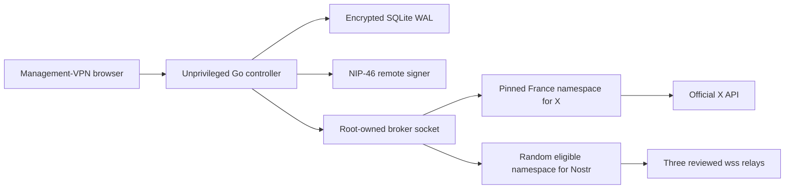

# iVPN private cross-poster

iVPN is a single-operator Go control plane for approving one exact text payload for X, Nostr, or both. It is designed around fail-closed egress, private routing metadata, and honest location semantics.

**Current safety state: dry-run only.** The application refuses `IVPN_DRY_RUN=false`. X OAuth, the official X create-post connector, NIP-46 boundaries, Nostr quorum logic, country selection, the broker contract, and infrastructure topology exist, but real Linux namespace execution is deliberately disabled until packet-capture evidence proves there is no direct fallback.

VPN egress changes network origin. It does not hide X credentials, a Nostr pubkey, content, timing, or account identity, and the app never claims the operator was physically in an exit country.

## What is implemented

- Go 1.26.5 control plane with server-rendered HTML and SQLite WAL.
- Two-passkey production readiness policy, WebAuthn ceremonies, strict sessions, and CSRF checks.
- AES-256-GCM envelope encryption with a fresh data key per draft, auth record, receipt, audit event, and X OAuth token record.
- One-time offline recovery-code rotation and failure rate limiting; the code is shown only when generated.
- Exact normalized-payload preview, SHA-256 approval binding, optional scheduling, cancellation, emergency stop, and manual reconciliation without blind resend.
- Official `POST https://api.x.com/2/tweets` connector, fixed endpoint, no `geo`, bounded responses, one refresh after a definitive 401, 429 reset handling, and `UNKNOWN` on ambiguous transport results.
- OAuth 2.0 Authorization Code with S256 PKCE using only `tweet.read`, `tweet.write`, `users.read`, and `offline.access`; encrypted token persistence and official revocation.
- NIP-01 canonical event IDs, NIP-46 kind restrictions, NIP-42 relay/challenge binding, one signature reused across three reviewed relays, and a two-relay quorum.
- CSPRNG Nostr country selection, no adjacent country repeat, three-country minimum, and a fixed France policy for X.
- Registry-only broker requests. Arbitrary commands, routes, paths, addresses, and shell fragments are not representable.
- Orange, purple, and graphite-gray cypherpunk UI with system fonts, visible focus, reduced motion, label-plus-color states, and no pre-dispatch country disclosure.
- Seven-day deletion of resolved job metadata and receipts while unresolved `UNKNOWN` and `PARTIAL` jobs remain available for reconciliation.

## Architecture



The target diagram is not a claim that the disabled namespace executor is complete. See [deployment gates](deploy/DEPLOYMENT.md) and the [threat model](docs/THREAT_MODEL.md).

## Local dry-run

Install Go 1.26.5, then in PowerShell:

```powershell
go build -o bin/ivpn.exe ./cmd/ivpn
$env:IVPN_MASTER_KEY = (& .\bin\ivpn.exe --generate-master-key)
$env:IVPN_DEV_MODE = 'true'
$env:IVPN_ORIGIN = 'http://localhost:8443'
$env:IVPN_RPID = 'localhost'
$env:IVPN_DRY_RUN = 'true'
.\bin\ivpn.exe
```

Open `http://127.0.0.1:8443`. Development mode bypasses passkey enforcement so local UI and state flows can be inspected. It must never be used for live credentials or publishing.

Production configuration also requires TLS certificate/key paths, a random bootstrap token of at least 32 characters, an HTTPS origin, and host/TPM-backed secret delivery. Prefer `IVPN_MASTER_KEY_FILE` and `IVPN_BOOTSTRAP_TOKEN_FILE`; the app rejects relative, oversized, symlinked, or group/world-readable files on Linux. `.env` files are excluded from Git and are not an approved production secret store.

`IVPN_X_ESTIMATED_CHARGE` is operator-supplied from the account's current X billing portal. If absent, the approval preview says the estimate is unavailable. The code does not invent a price.

## Verification

```sh
go mod verify
go test -race -count=1 ./...
go vet ./...
go run golang.org/x/vuln/cmd/govulncheck@v1.6.0 ./...
```

The CI workflow pins its GitHub Actions to exact upstream tag commits and pins govulncheck to v1.6.0. See [verification evidence and unresolved gates](docs/VERIFICATION.md).

## Production blockers

- No reviewed Linux namespace/WireGuard/nftables executor yet.
- No packet-capture proof for tunnel removal during DNS, TLS, OAuth refresh, signing, transmit, or response handling.
- No broker-backed dispatcher or pinned per-platform network transports. Approved jobs remain queued, and X OAuth/publishing stays unavailable.
- No provisioned cloud gateways, validating resolvers, static IP verification, or provider budget alerts.
- No concrete NIP-46 transport or BIP-340/Schnorr verification adapter.
- No TPM/host-secret-store sealing adapter; strict secret-file loading alone is not sealing.
- Exact job state, timestamps, destination flags, and payload hashes remain plaintext SQLite indexes; other sensitive records are envelope-encrypted.
- No live X reconciliation worker, live relay review, complete accessibility audit, or seven-day canary.
- No tested-account evidence or written X clarification for per-post country rotation. X remains pinned to France by policy.

These are fail-closed blockers, not follow-up polish. Live mode stays disabled until all release gates in [SECURITY.md](docs/SECURITY.md) pass three clean adversarial rounds.
